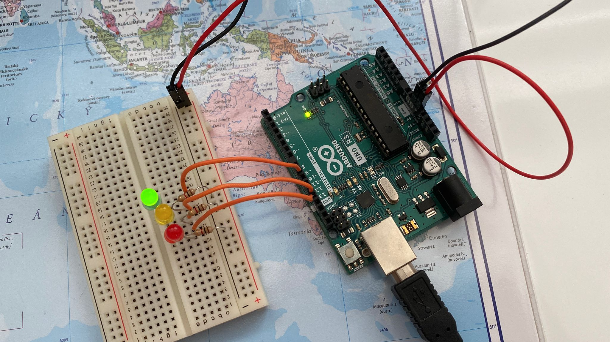
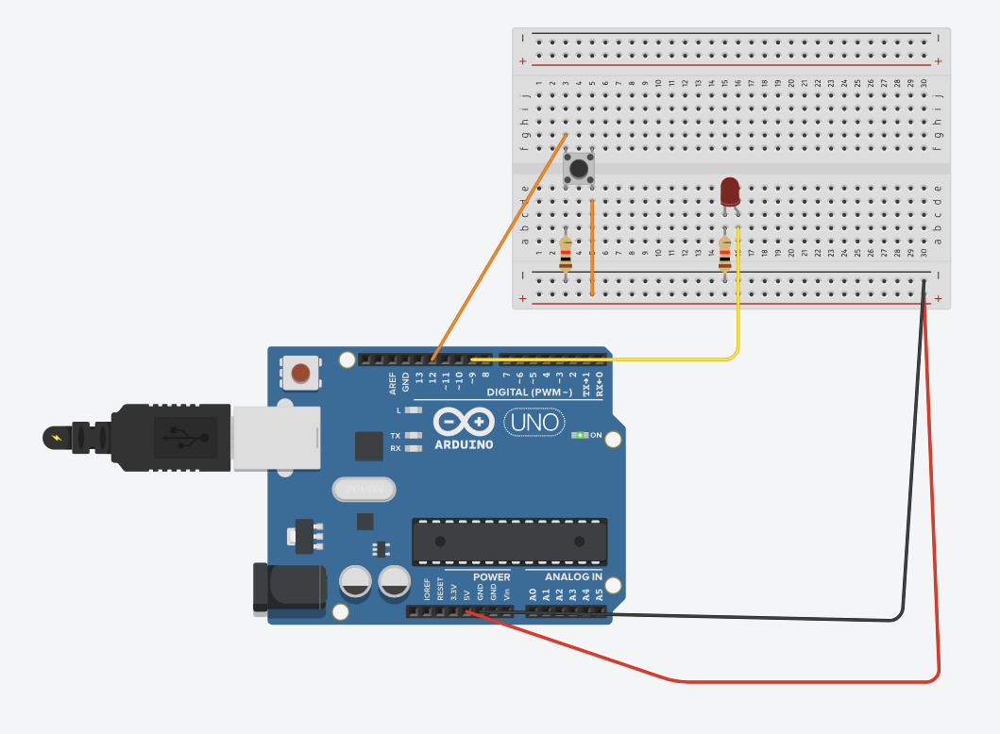
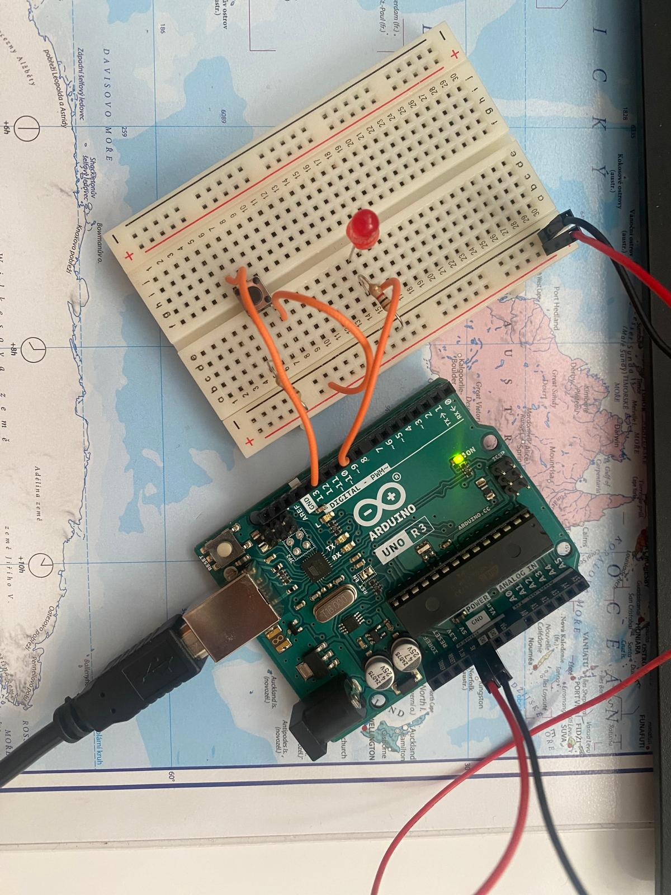
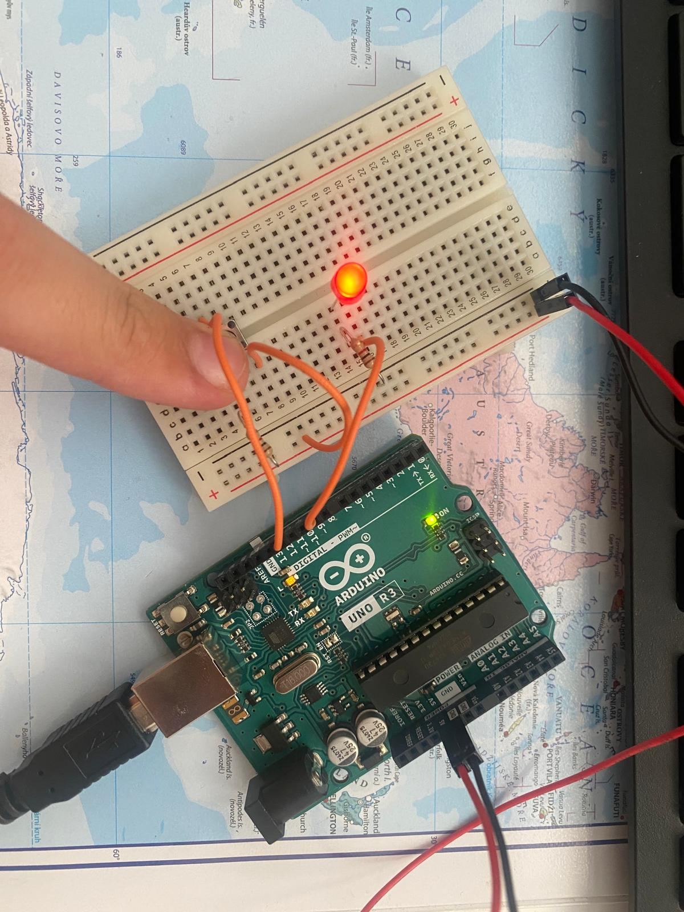

# arduino-traffic-light + button

## Traffic Light
- 1x Arduino Uno  
- 1x Breadboard  
- 3x LEDs (Rot, Gelb, Grün)  
- 3x Widerstände (220 Ω oder ähnlich) (ich hab ein kilo ohm benutzt weil es keine anderen gab)  
- Jumper-Kabel  
- USB-Kabel für den Arduino  

---

## Aufbau
So sieht der Schaltplan aus:  

---

## Der Code
Der komplette Code liegt in der Datei `sketch1.ino`

---

## Button
- 1x Arduino Uno  
- 1x Breadboard  
- 1x LEDs (Grün)  
- 1x Widerstände (ich hab ein kilo ohm benutzt weil es keine anderen gab)  
- Jumper-Kabel  
- USB-Kabel für den Arduino  

---

## Aufbau
So sieht der Schaltplan aus:  

#OFF

#ON

---

## Der Code
Der komplette Code liegt in der Datei `sketch2.ino`
